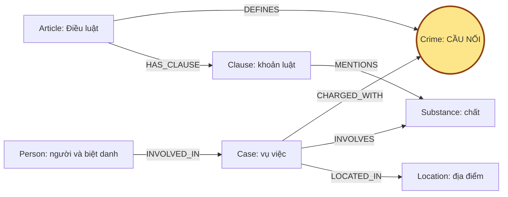

# Thiết kế Ontology — Day 19

**Họ tên:** Nguyễn Nhân Sâm

**MSSV:** 2A202602672

**Phiên bản:** v1, ngày 05/10/2026.

**Lựa chọn:**

- [x] Dùng ontology gợi ý, bổ sung quản lý nguồn và quy tắc retrieval.
- [ ] Tự thiết kế để xét bonus +15.

**Trạng thái:** KG-1..KG-4 đã triển khai trong `src/graph.py`; node embeddings và BFS nằm riêng trong `src/graph_retrieval.py`. Kết quả kiểm tra hợp đồng: 7 OK; suite: 64 passed (48 test gốc + 16 test bổ sung). Graph đầy đủ có 203 node / 378 cạnh; bằng chứng Cypher được lưu ở `graph_evidence.json`. Số liệu đánh giá nằm trong hai báo cáo đi kèm.

## 1. Sơ đồ

Tin tức cung cấp người, vụ, tội được báo nêu, chất, khối lượng và mức án. Luật cung cấp Điều, khoản, tên tội chuẩn và khung hình phạt. `Crime` nối hai KB; `Substance` giúp tìm khoản liên quan chất và tổng hợp vụ, nhưng không tự xác định tội danh.

Q3 đi theo `Person → Case → Crime ← Article → Clause`. Mức án đã tuyên ở cạnh người–vụ và khung luật ở khoản là hai loại thông tin khác nhau.

## 2. Entity types (node labels)

| Label | Ý nghĩa | Khóa MERGE | Properties thực hiện | KB | Trích bằng |
| --- | --- | --- | --- | --- | --- |
| Article | Một Điều trong một văn bản luật | `id`, ví dụ `Điều 251 BLHS` | `id`, `title`, `law`, `doc_id` | Luật | Metadata, regex |
| Clause | Một khoản của Điều | `id = Article.id + khoản + number` | `id`, `number`, `penalty`, `text`, `doc_id` | Luật | Regex |
| Crime | Tội danh chuẩn, cầu nối | `name` chuẩn hóa | `name`, `source_doc_ids` | Luật; tin liên kết về luật | Regex, chuẩn hóa, entity linking |
| Case | Vụ việc từ tin | `name` của baseline gợi ý | `name`, `summary`, `date`, `doc_id`, `source_title` | Tin | LLM trả JSON |
| Person | Người liên quan, có thể ở nhiều bài | `name` của baseline gợi ý | `name`, `aliases`, `doc_id` nguồn đầu, `source_doc_ids` | Tin | LLM; chuẩn hóa Unicode/khoảng trắng |
| Substance | Chất trong luật hoặc vụ việc | `name` chuẩn | `name`, `source_doc_ids` | Cả hai | Danh sách chất, LLM |
| Location | Địa điểm vụ việc | `name` | `name`, `source_doc_ids` | Tin | LLM |

KG-2 đã ghi `source_doc_ids` cho Crime, Case, Person, Substance, Location và mọi cạnh. Article/Clause giữ `doc_id = Document.id`; Case/Location/Person giữ doc_id nguồn đầu tiên và danh sách nguồn hợp nhất. Crime/Substance dùng danh sách nguồn thay vì gán một doc_id giả. Doc ID ánh xạ tới URL, ngày lấy và phiên bản trong markdown/`sources.csv`. Các thuộc tính nghiệp vụ của Case/cạnh có thể bị cập nhật bởi nguồn sau; danh sách nguồn không thay thế lịch sử từng phiên bản.

Neo4j có UNIQUE constraint trên `Article.id`, `Clause.id` và `name` của năm label còn lại. Phần mở rộng ghi thêm `embedding` (vector Gemini 3072 chiều), `embedding_model`, `embedding_text` trên từng node. Embedding text ghép loại node, tên/id, title, summary, text và aliases, tối đa 3500 ký tự phần nội dung. Metadata công khai ở `node_index_metadata.json`; vector đầy đủ ở Neo4j và cache local.

Khóa theo tên của Case/Person chưa giải quyết triệt để nhiều bài cùng vụ hoặc người trùng tên. Constraint UNIQUE chỉ bảo đảm duy nhất theo khóa trong database, không chứng minh đó là một thực thể ngoài đời.

## 3. Relationships

| Type | Từ → Đến | Properties thực hiện | Ý nghĩa |
| --- | --- | --- | --- |
| DEFINES | Article → Crime | `source_doc_ids` | Điều định nghĩa tội |
| HAS_CLAUSE | Article → Clause | `source_doc_ids` | Khoản thuộc Điều |
| MENTIONS | Clause → Substance | `source_doc_ids` | Khoản nhắc chất; chưa chứng minh khoản áp dụng |
| CHARGED_WITH | Case → Crime | `source_doc_ids` | Tội/hành vi bị cáo buộc được nguồn nêu |
| INVOLVES | Case → Substance | `amount`, `source_doc_ids` | Chất và khối lượng nguyên văn |
| LOCATED_IN | Case → Location | `source_doc_ids` | Địa điểm liên quan vụ |
| INVOLVED_IN | Person → Case | `role`, `charge`, `sentence`, `source_doc_ids` | Vai trò, tội và mức án riêng của người |

Cạnh tin đã giữ nguồn trích. Một vụ có thể có nhiều tội; kiểm tra `INVOLVED_IN.charge` trước khi dùng đường Case → Crime cho một người. Bài Q2 có bốn người về tội mua bán và hai người khác về tội tổ chức sử dụng; không gán tất cả tội cho tất cả bị cáo.

`amount` giữ “hơn 9,6kg”, “khoảng 406g”, “5 viên”; không tự đổi viên thành gam khi nguồn không có quy đổi. Chưa có ngưỡng numeric trong graph.

## 4. Node cầu nối giữa hai KB

**Crime là cầu nối chính:** báo nêu tội/hành vi, tiêu đề Điều BLHS định nghĩa tội tương ứng. Cùng MDMA có thể là mua bán, vận chuyển hoặc tàng trữ nên chỉ nối theo chất là chưa đủ.

Chuẩn hóa và liên kết đã thực hiện:

1. Lấy tên chuẩn từ Điều BLHS; bỏ tiền tố “Tội”, chuẩn hóa chữ hoa/thường và khoảng trắng.
2. Cho danh sách chuẩn vào prompt rồi vẫn kiểm tra output bằng `link_entity`.
3. Ưu tiên exact match, sau đó fuzzy cutoff 0.8; trả tên gốc trong danh sách hoặc `None`.
4. Alias “Hoàng Nato” nằm trong `Person.aliases` để tìm Dương Minh Tuấn.
5. Chất được LLM trích; LLM có thể gán thuốc lắc thành MDMA khi nguồn chưa xác nhận thành phần. Cần đối chiếu extraction với nguồn, không xem tên chất do LLM tạo là bằng chứng giám định.

Cầu gãy khi thiếu extraction, tên không khớp hoặc tội không có trong corpus. Ghi nguồn/lỗi để rà lại; không nối ép sang tội gần giống. Ví dụ nhận hối lộ và đánh bạc không có Điều tương ứng trong KB luật của lab.

Case mang doc_id của tin, Article mang doc_id của luật. Đường `Case → Crime ← Article` dài hai cạnh, phù hợp check xuyên KB ≤4 cạnh.

## 5. Competency questions

Đường và nguồn dưới đây được pipeline chuẩn sử dụng. KG-3 lấy seed từ tên/alias và doc_id chunk; lấy các vụ, người, lượng chất và đủ khoản luật theo Crime. Các câu hỏi về khung cơ bản/tối đa được ưu tiên khoản phù hợp trước giới hạn 60 facts. Việc có đường đi không tự bảo đảm đáp án đúng; xem kết quả Q1–Q6 trong `REPORT_KG.md`.

| Câu | Cypher pattern / đường đi | Trả lời được? |
| --- | --- | --- |
| Q1 — tiền chất | `(a:Article {id:'Điều 2 Luật PCMT'})-[:HAS_CLAUSE]->(cl:Clause {number:4})`; tìm từ khóa trong `cl.text` hoặc chunk | Có dữ liệu; không có node Term. Phải lấy khoản 4, không chỉ khoản 1. |
| Q2 — hai người tử hình | `(p:Person)-[r:INVOLVED_IN]->(k:Case)`; xác định vụ bằng doc_id và lọc sentence | Có dữ liệu; mức án phải gắn đúng người. Không cần luật cho câu này. |
| Q3 — Thành, mức án, Điều/khung | Person → Case → Crime ← Article → Clause number=1; lấy r.sentence và r.charge | Có dữ liệu. Phân biệt khung cơ bản với căn cứ xét xử cụ thể được bài nêu. |
| Q4 — Hoàng Nato, mức tối đa | Person qua alias → Case → Crime ← Article → đủ khoản phạt tù | Có dữ liệu. Khoản 4 Điều 255 không nhắc chất; không chỉ lọc theo chất. |
| Q5 — Huy, khối lượng, khoản | Person → Case → Crime ← Article → Clause; Case → Substance qua r.amount | Có văn bản để LLM đối chiếu hơn 9,6kg MDMA với ngưỡng 100g, khoản 4 điểm b Điều 250. Baseline chưa xác định khoản bằng rule numeric. |
| Q6 — các vụ MDMA | `(k:Case)-[:INVOLVES]->(:Substance {name:'MDMA'})`, thêm Person/summary/nguồn | Có dữ liệu nếu extraction đủ. Query toàn graph theo chất, khử trùng vụ, không giới hạn ở vài chunk top-k. |

### Bằng chứng nguồn đã đọc

| Câu | Source IDs | Nội dung nguồn |
| --- | --- | --- |
| Q1 | `pcmt-dieu-2` | Khoản 4: tiền chất là hóa chất không thể thiếu trong điều chế, sản xuất chất ma túy, thuộc danh mục do Chính phủ ban hành. |
| Q2 | `news-100260928173914514` | Trần Thanh Tuấn và Trần Minh Tâm bị tuyên tử hình; những người khác có tội/mức án riêng. |
| Q3 | `news-100260918080821054`, `blhs-dieu-251` | Thành bị tuyên sơ thẩm 36 tháng; khoản 1 Điều 251 có khung 02–07 năm. |
| Q4 | `news-100260920221957595`, `blhs-dieu-255` | Dương Minh Tuấn tức Hoàng Nato bị bắt để điều tra về tổ chức sử dụng; khoản 4 nêu 20 năm hoặc chung thân. |
| Q5 | `news-100260917203001265`, `blhs-dieu-250` | Huy bị truy tố về vận chuyển hơn 9,6kg MDMA/khoảng 406g Ketamine; khoản 4 điểm b Điều 250: MDMA từ 100g, tù 20 năm/chung thân/tử hình. |
| Q6 | `news-100260917203001265`, `news-100260918080821054`, `news-100260924105118645`, `news-100260930085028036` | MDMA ở vụ Huy, vụ Thành, vụ Viện Pháp y tâm thần. Hai bài cuối không mặc định là hai vụ độc lập. |

Đáp án là đối chiếu corpus/gold, không xác nhận bản án thực tế hoặc luật hiện hành. Corpus luật là snapshot BLHS 2015 sửa đổi 2017 và Luật PCMT 2021 được cung cấp cho lab.

## 6. Quyết định thiết kế và đánh đổi

1. **Neo4j, schema gợi ý cho baseline.** NetworkX dễ duyệt trong Python nhưng bộ check/ảnh dùng Neo4j. Node embeddings và BFS đã bổ sung trên cùng graph, không thay bộ chấm chuẩn. Seed phần mở rộng ưu tiên tất cả Person có tên/alias trong câu, rồi Substance khi câu tổng hợp, còn lại chọn top-3 cosine. BFS dùng queue/visited, tối đa 4 hop/180 node và bỏ cạnh MENTIONS để tránh hub luật–chất. Serialize tối đa 100 facts, ưu tiên văn bản khoản và summary; đây là BFS trên tập cạnh được chọn.
2. **Regex cho luật, LLM cho tin.** Luật có cấu trúc Điều/khoản; regex rẻ và tái lập. Tin có tên/alias/vai trò/mức án nên dùng LLM. Trích cả corpus bằng LLM tốn hơn và cần kiểm tra tách khoản; yêu cầu NER/triples trong ảnh được theo dõi ở phần mở rộng.
3. **Sentence/role/charge ở cạnh Person → Case.** Đặt sentence trên Person dễ ghi đè giữa vụ; đặt trên Case gán nhầm đồng bị cáo. Node Judgment/Event chi tiết hơn nhưng là cải tiến sau baseline.
4. **Giữ text khoản và khối lượng nguyên văn.** Node Threshold/range có thể hỗ trợ Q5 bằng rule nhưng cần parser, đơn vị và nhiều chất đúng. Baseline chưa có khả năng tính ngưỡng tự động.
5. **Chọn khoản theo mục đích câu hỏi.** Khung cơ bản lấy khoản 1; mức tối đa lấy đủ khoản phạt tù; aggregation mở rộng toàn graph từ Substance. Mọi khoản cho mọi câu tốn token; lọc chất đơn thuần thiếu Q4.
6. **Giữ chunk và graph facts.** Graph-only dễ mất ngữ cảnh extraction/tố tụng. Chunk giúp đối chiếu nguyên văn, nhưng prompt dài hơn. Graph bổ sung text không bảo đảm câu trả lời tốt hơn; cần benchmark thật.

## 7. So với ontology gợi ý

Chưa xét bonus +15. Giữ bảy label, bảy quan hệ của gợi ý; provenance và chọn khoản là cải thiện thực hiện baseline, chưa phải bằng chứng thiết kế ontology mới.

Nếu làm bonus, ưu tiên ngưỡng định lượng cho Q5 hoặc sự kiện/giai đoạn tố tụng. Cần baseline `ket_qua_benchmark_kg.hint.txt`, số liệu/Cypher trước–sau và câu được cải thiện trước khi khẳng định đạt bonus.

## 8. Hạn chế còn lại

- **Tố tụng:** Huy bị truy tố/chuẩn bị xét xử; Hoàng Nato bị bắt/điều tra; Thành có mức án sơ thẩm. Không tự kết luận đã có án hoặc kết quả phúc thẩm cho mọi người.
- **Case/Person trùng:** name-only MERGE chưa giải quyết trùng tên hoặc nhiều bài cùng vụ. Alias phải được hợp nhất, tránh ghi đè.
- **Teaser lẫn bài:** cuối `news-100260918080821054` có đoạn giới thiệu Cái Quang Huy; không phải người trong vụ Thành. Cần nhận diện teaser trong extraction và giữ raw corpus chung cho hai pipeline.
- **Q6/gold:** bốn bài nhắc MDMA không đồng nghĩa bốn vụ. Phải truy nguồn và kiểm tra kết quả dư/trùng, không chỉ keyword recall.
- **Q1:** không có Term node; chỉ lấy khoản 1 sẽ thiếu định nghĩa khoản 4. Không dùng gold để bổ sung retrieval.
- **Chất ngoài danh sách:** etomidate có trong tin, chưa có ở danh sách chất gợi ý. Không ép về MDMA/Ketamine.
- **Khối lượng/định khung:** chưa có range numeric, rule tình tiết hoặc quy đổi tổng nhiều chất. MENTIONS không chứng minh khoản áp dụng.
- **Đánh giá:** recall và LLM judge không thay thế kiểm tra nguồn. Kết quả chỉ áp dụng corpus/cấu hình/lần chạy được ghi trong báo cáo; cùng LLM trả lời và chấm có thể thiên lệch.

Các query đối chiếu label, quan hệ, nguồn, lượng node có embedding và các trường hợp lỗi được lưu nguyên văn cùng kết quả ở `graph_evidence.json`. Ba ảnh Neo4j là graph từ lượt benchmark đầy đủ cuối, không dùng ảnh mẫu trong `docs/img/`.
